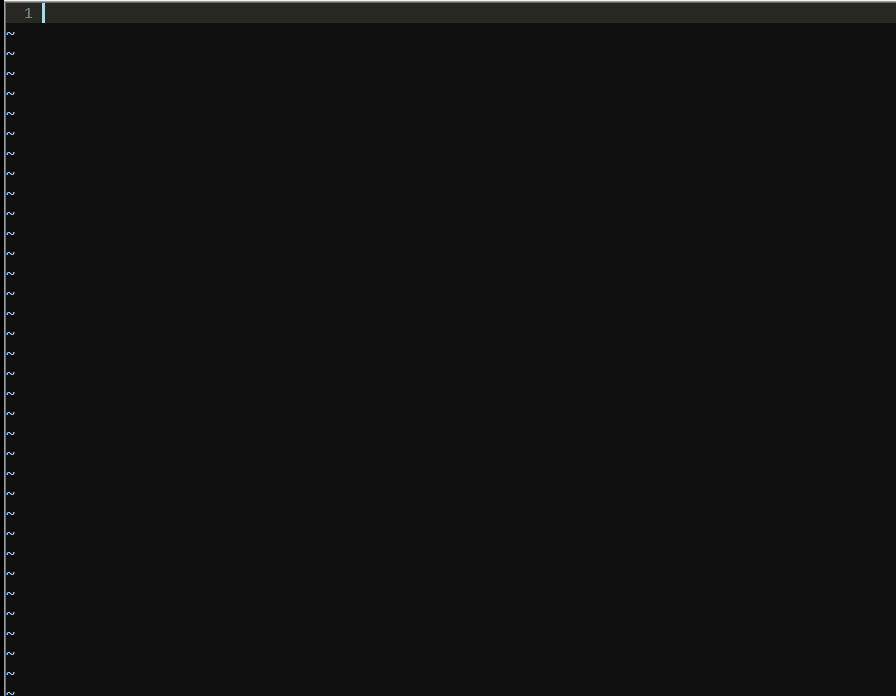
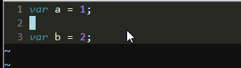

FastVimEditor -- 前端开发超快的编辑器
=================================

### 感受一下

### 特性
* VIM编辑器，记住几个命令就能超快开发页面
* 无需繁杂的配置项，即刻使用
* 漂亮的UI界面，让VIM远离枯燥
* 方便快捷的插件体系

### 教程

#### 安装

解压vim.zip，打开vim/vim72/install.exe, 输入d 1
打开文件的时候可以设置打开的默认应用程序为gvim.exe

#### 命令键与输入切换
vim有两种模式，命令模式下可以输入命令键，输入模式下可以输入内容

进入命令模式： esc

进入插入模式： i(前插入)  a(后插入)

#### 上下左右
指法： 上：k  下:j  左：h  右:l
或者方向键，建议还是使用上面的指法

#### 撤销和重做

这个是很重要的命令
撤销：命令模式，使用u
重做：命令模式：使用ctrl + r

#### 删除整行
命令模式下使用dd，可以删除整行

#### 删除多行
命令模式下 按行数，再按dd

#### 换行插入
命令模式下，按o,如果在行前面插入，可以使用O

#### 粘贴复制
命令模式下使用v，进行选择模式，选择完了按y，复制，然后在需要的地方按p粘贴

使用shift + y来复制整行，p来粘贴
dd命令可以做剪切，p来复制

#### 保存文件
命令模式下使用:w来保存文件，:wq保存并退出，:w!强制退出，:q!强制保存

#### 行首行尾
shift + 6, shift + 4,随便试，试多了就记住了
#### 跳到页首，页尾

gg: 页首， shift + g: 页尾

#### 选择一段文本
v进入选择模式，使用kjhl来调整选取

### 多tab操作
#### 新建一个tab
:tabnew
:tabnew f.js
#### 切换一个tab
gt:下一个
gT: 上一个
#### 对比开发
:vs
:vs f.js

切换工作区: ctrl + tab键

#### 打开文件列表
ff 打开文件列表
